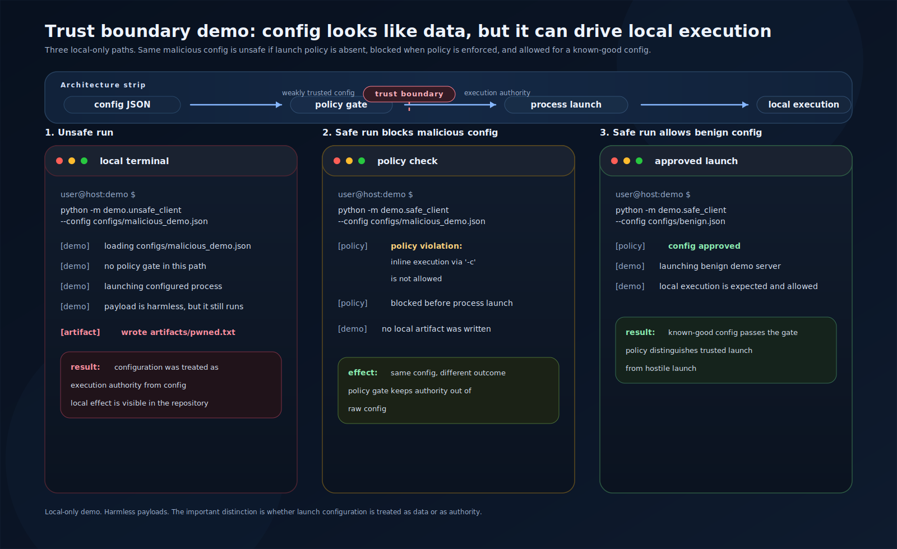

# MCP Trust Boundary Demo

This repo shows a narrow security issue in MCP-style local `stdio` clients: server config can look like setup data, but it can function as execution authority on the local machine. The unsafe path trusts that config too far. The guarded path applies a small policy gate and blocks the same launch.



## Quick Start

```bash
python -m pip install -r requirements.txt
python -m demo.unsafe_client --config configs/malicious_demo.json
python -m demo.safe_client --config configs/malicious_demo.json
python -m demo.safe_client --config configs/benign.json
pytest
```

## Architecture

Unsafe path:

```text
config JSON -> parser -> subprocess launch -> local execution
```

Guarded path:

```text
config JSON -> policy checks -> approved launch -> local execution
```

The difference is not the transport. It is whether launch metadata is treated as ordinary input or as something that needs explicit control.

## Unsafe vs Safe Walkthrough

Unsafe mode accepts the malicious demo config and launches the local process it names. The payload is harmless, but the control flow is the point: config changes execution.

Safe mode rejects that same config with `policy violation: inline execution via '-c' is not allowed`. It then accepts `configs/benign.json`, which passes the allowlist and starts the benign demo server.

## What This Repo Demonstrates

- In local `stdio` clients, server config can carry execution authority.
- Launch metadata is security-sensitive, not just bookkeeping.
- Small policy checks can block an unsafe launch without changing the transport.
- Automated or agentic setup makes weak trust boundaries easier to miss.

## What This Repo Does Not Demonstrate

- A universal MCP exploit
- A protocol-level zero-day
- Remote exploitation
- Persistence, exfiltration, or destructive behavior
- A claim that every MCP client is vulnerable

## Why This Gets Worse In Agentic Systems

The risk gets sharper when tool setup and launch happen inside more automated workflows. The less often a person stops to read what a config actually launches, the easier it is for execution authority to ride in as if it were just setup data.

## Responsible Use

Keep the demo local and contained to the repository. The payloads should stay harmless and limited to visible markers or files under `artifacts/`. Do not extend the code toward persistence, stealth, exfiltration, or live-target testing.

## Threat Model

See [docs/threat_model.md](docs/threat_model.md).

## FAQ

### Is this just subprocess hygiene?

No. The issue is narrower: in local `stdio` MCP clients, the config itself can decide what gets executed.

### Does this prove MCP is broken?

No. It shows one implementation pattern that collapses the boundary between setup data and execution authority.

### Why keep the demo so small?

Because the failure mode is easier to see when the code only covers launch policy, not a larger framework.
